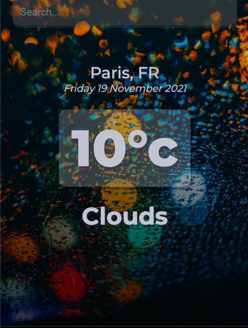
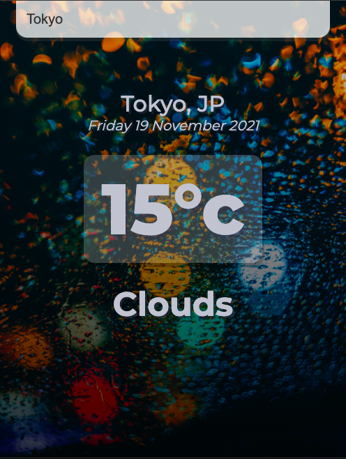

# Weather App  

You can view my project live here: ----> https://globalweatherapps.netlify.app/

# What is our project about?

A React Weather App that can see the temperature of all major cities in the world.

Technologies Used:

* JavaScript (ES6)
* CSS
* ReactJS
* Git and GitHub

Here is the search button. Type in the major cities of your choice.

